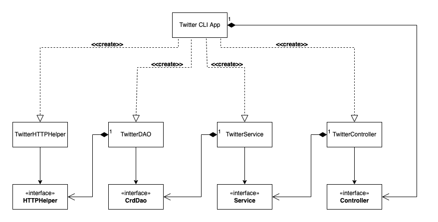

# Introduction
This project is a command-line tool that uses the `Twitter API` to post, show or delete tweets under the account associated with the OAuth 1.0 keys. 
`HttpClientBuilder` is used to send HTTP requests and receive responses. 
A simplified `Tweet model` was built for the application. `Jackson` is used to for the serialization and deserialization of JSON.
`Java reflection` is also briefly used in the service layer to filter fields on the `show` option. 
Spring and SpringBoot were used to manage dependencies.
The project is also managed by `Maven` and `dockerized` for simple distribution.

# Quick Start
Please ensure you have set OAuth 1.0 keys as environment variables.
## Maven
```
mvn clean compile package
java -jar target/twitter-1.0-SNAPSHOT.jar show|post|delete [options]
```

## Docker
```
docker pull mkr0129/twittercli

docker run \
-e consumerToken=consumerToken \
-e consumerSecret=consumerSecret \
-e AccessToken=accessToken \
-e tokenSecret=accessSecret \
mkr0129/twittercli show|post|delete [options]
```

# Design
## UML Diagram


## Component Details
### TwitterCLIApp
Main control and entry point of the application. TwitterCLIApp contains `run` and `printTweet` methods.
`Run` parses the first command-line argument and decides which controller function `[post|show|delete]` to call
or will throw an error if the command to be run is invalid. 
`printTweet` is a simple helper function to print the returned tweet(s) from the controller excluding null values.

### TwitterController
The twitter controller parses the additional command-line arguments specific to the command being run and then calls the
appropriate service method `[post|show|delete]` with the parsed arguments or throw an error if the arguments do not
match what is required for that command.
The controller will then return the tweet(s) to `TwitterCLIApp`.

### TwitterService
The Twitter service layer executes business logic. 
`post` will validate that text length is under 140 characters and that lat/lon values are in range and then call the dao's create method. 
The `show` method will call the dao's findById method then filter the tweet to the specified fields (or skip if no fields are specified).
`delete` will iterate through the id array and call the dao's deleteById method for each id value.

### TwitterDAO
The `TwitterDao` builds the request URI based on which method is called and what arguments are provided.
The URI is passed to either the `post` or `get` methods in the `TwitterHttpHelper`. 
In all cases, the response from the API is processed by checking the response status code and deserializing the JSON into a Tweet object.
The tweet is then returned to the service layer.

### TwitterHttpHelper
`TwitterHttpHelper` uses `HttpClientBuilder` to create a http client and executes a request with the uri provided as an argument.
There is one method for `post` and one method for `get`. 

## Models
### Tweet 
```
String created_at
long id
String id_str
String text
Entities entities
Coordinates coordinates
Integer retweet_count
Integer favorite_count
Boolean favorited
Boolean retweeted
```
### Entities
```
List<Hashtag> hashtags
List<user_mentions> userMentions
```
### Hashtag
```
int[] indices
String text
```
### UserMention
```
long id
String id_str
int[] indices
String screen_name
```
### Coordinates
```
double lat
double lon
double[] coordinates
```

## Spring
Spring has been added to this project due to the chaining nature of dependencies in the architecture. 
`TwitterCLIBean` uses the @Beans approach to solve the dependency problem. @Configuration has been commented out in favour of TwitterCLISpringBoot
`TwitterCLISpringBoot` uses SpringBoot to search the root project for components as a way to manage dependencies with a lot less boiler code
(web servlet turned off as there is no use in this application).

# Test
This project has been both unit tested and integration tested at every layer. 
HttpHelper, dao, service and controller classes all have both unit and integration test files associated with them.
In all tests `JUnit` was used to test with assertions. 
In the case of unit tests `Mockito` was used to test isolated components.

# Deployment
The project is deployed on docker hub under`mkr0129/twittercli`

# Improvements
1. More extensive functionality such as the ability to search for tweets.
2. Pretty-er printing. JSON prints with indentation for easy readying but a more extensive visual experience could be an area for improvement.
3. Better designed tests. Failing and happy paths were implemented as possible, but better test design could be explored to strengthen the application.