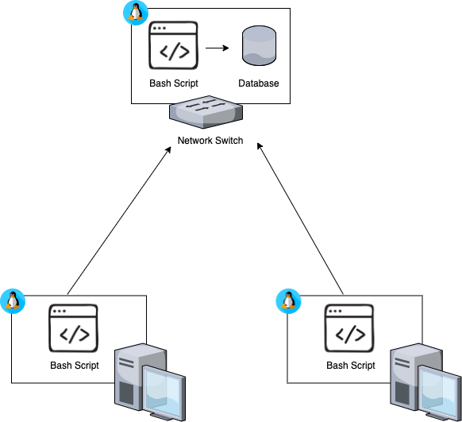

# Linux Cluster Monitoring Agent
This project is under development.  Since this project follows the GitFlow, the final work will be merged to the master branch after Team Code Team.

# Introduction
This project is used to log linux usage data and track potential outages.  
The script running on the network switch collects hardware and usage data from multiple linux nodes.  
The nodes send hardware data on startup and usage data every minute by the use of a crontab. 
An outage is detected when a node has not sent at least 3 queries in the past 5 minutes.

# Quick Start
````
#start psql instance and create tables 
./scripts/psql_docker.sh create db_username db_password
./scripts/psql_docker.sh start|stop
psql -h host_name -U psql_user -d host_agent -f sql/ddl.sql

#add host_info data into database
./scripts/host_useage.sh psql_host psql_port db_name psql_user psql_password

# add crontab to execute useage_info script every minute
crontab -e
* * * * * bash /pwd/scripts/host_useage.sh psql_hostname psql_port db_name psql_user psql_password

# or execute manually
./scripts/host_useage.sh psql_host psql_port db_name psql_user psql_password
````
# Implementation 
The implementation of the project started with creating the psql_docker.sh script to allow easy psql control using docker containers. 
Two database tables were created one for host information and one for usage information.  SQL queries to group hosts by hardware info, average 
memory usage, and to detect host failure were then designed and implemented in /sql/queries.sql. 
Finally, the monitoring agent was implemented in /scripts. This includes the host_info script and the 
host_usage script.  Both scripts use linux commands to find and capture information before inserting 
them into the specified psql database.

## Architecture


## Scripts
- psql_docker.sh
  - creates starts and/or stops the docker container containing your psql instance
```
./psql_docker.sh create psql_user psql_password
./psql_docker.sh start|stop
```
- host_info.sh
  - collects host hardware info and inserts into the specified psql database (host_info table)
````
./host_info.sh psql_host psql_port db_name psql_user psql_password
````
- host_useage.sh
  - collects host's current usage data info and inserts into the specified psql database (host_usage table)
````
./host_useage.sh psql_host psql_port db_name psql_user psql_password
````
- crontab
  - edit crontab info to execute host_useage.sh every minute
````
crontab -e
* * * * * bash /home/centos/dev/jrvs/bootcamp/linux_sql/host_agent/scripts/host_usage.sh localhost 5432 host_agent postgres password
 > /tmp/host_usage.log
````
- queries.sql
  - executes queries over your host_agent database
````
psql -h host_name -p psql_port(5432) -U psql_user  -p psql_password -d host_agent -f /sql/queries.sql
````

## Database Modeling

### Host Info 

| Name       | Type         | Constraint  |
|------------|--------------|-------------|
| id         | serial       | primary key |
| hostname   | varchar(100) | not null    |
| cpu_number | int          | not null    |
| cpu_architecture | varchar(25)  | not null    |
| cpu_model | varchar(50)  | not null    | 
|cpu_mhz | float(3)     | not null    | 
|l2_cache | int          | not null    |
|total_mem | int          | not null    |
|time_stamp | timestamp    | not null    |

### Host Usage

| Name  | Type   | Contraint |
| --- | --- | --- |
| time_stamp | timestamp | not null |
|host_id | int | foreign key (HostInfo.id) |
| memory_free | float(3) | not null | 
| cpu_idle | int | not null |
| cpu_kernel | int | not null |
| disk_io | int | not null |
| disk_available | int | not null |

# Test
Bash scripts and SQL queries were run and inspected for expected output.

# Deployment
The GitHub Repo containing the scripts and queries are posted on GitHub.  
The Postgresql Docker image is used to create the database instance.

# Improvements
One improvement of this project is to implement actions taken once an outage is detected. 
The query returns possible outages but does not execute any follow-up scripts.

